<p align="center">
  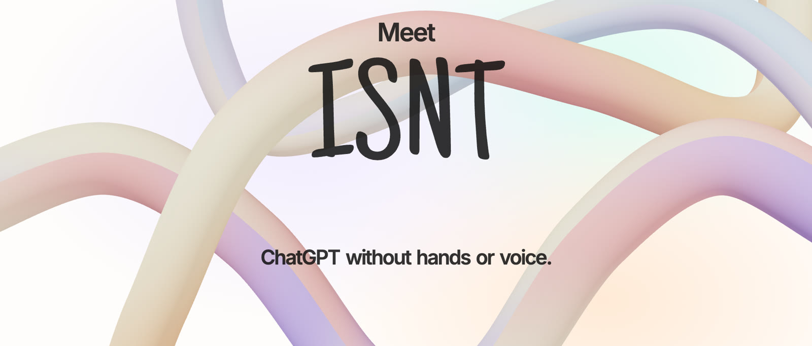
</p>

<p align="center">
  <b>A chat app you use with your head and face, not your hands or voice.</b><br>
  <sub>ISNT stands for <i>Ima Slike Nema Tona</i>, Croatian for "picture, but no sound".</sub>
</p>

<p align="center">
  <a href="https://ima-slike-nema-tona.vercel.app"><b>Try the app</b></a> ·
  <a href="https://drive.google.com/file/d/1eP4rHAvrxqSQlSEpNhEpwSYGSFeecTpL/view?usp=sharing"><b>Watch the demo</b></a> ·
  <a href="https://drive.google.com/file/d/12w3LYaAM4wuwUsN8UUkILTLVuoHm4P--/view?usp=sharing"><b>Read the project deck</b></a>
</p>

---

## What is ISNT?

Most people talk to ChatGPT by typing or speaking. Many people can do neither: someone who is paralysed from the
neck down, someone whose speech is affected by ALS, or someone who simply has their hands full.

ISNT is a prototype of a ChatGPT-style chat you can use with nothing but an ordinary laptop webcam:

- **Move your head** to move the pointer, like a mouse.
- **Hold still** on a button to get it ready.
- **Make a small face gesture**, like opening your mouth, to press it.

Instead of spelling a message letter by letter, you build it from **whole words and phrases** that AI suggests as
you go. A keyboard is still there for anything the suggestions don't cover.

<p align="center">
  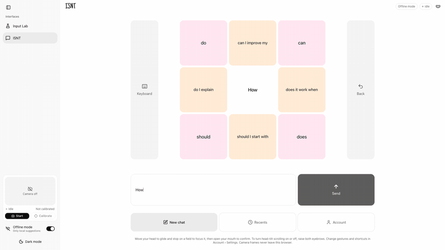
</p>

## How it works

### 1. Pressing a button without hands

A button is never pressed just because you look at it. That would cause accidental clicks all the time. Instead,
every press takes three steps:

| Step | What you do | What you see |
| --- | --- | --- |
| **Point** | Turn your head toward a button | The pointer glides there and snaps to the button |
| **Hold** | Keep still for about half a second | The button fills up, then it is *armed* |
| **Confirm** | Open your mouth | The button is pressed |

### 2. Writing with words, not letters

<table>
  <tr>
    <td width="50%">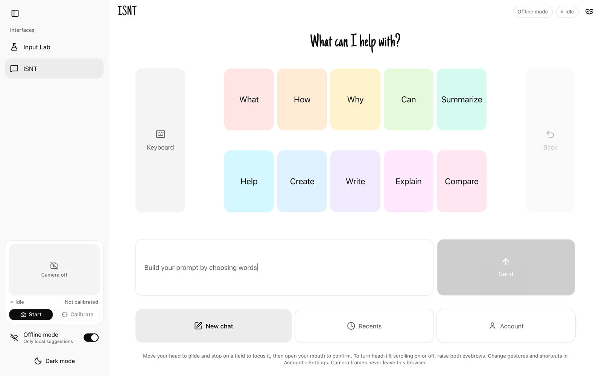</td>
    <td width="50%">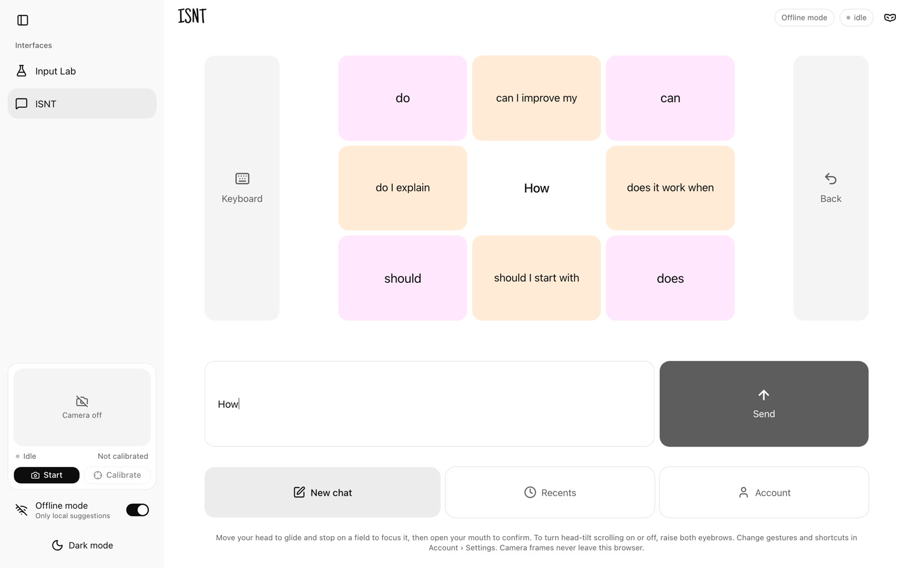</td>
  </tr>
  <tr>
    <td><b>Start with a word.</b> Ten common first words, like <i>What</i>, <i>How</i> or <i>Create</i>.</td>
    <td><b>Keep picking.</b> Your text moves to the middle. Phrases appear on the sides, single words in the corners,
    and they refresh after every pick.</td>
  </tr>
  <tr>
    <td>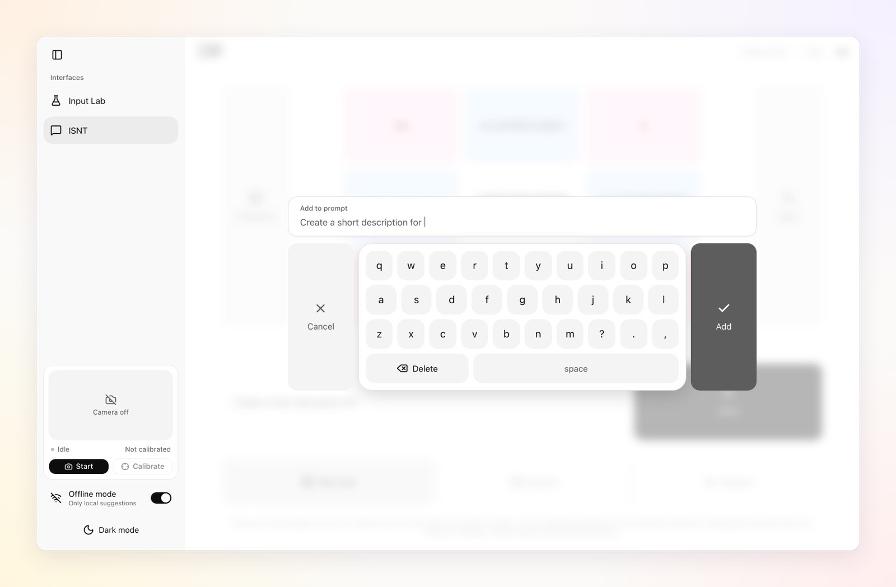</td>
    <td>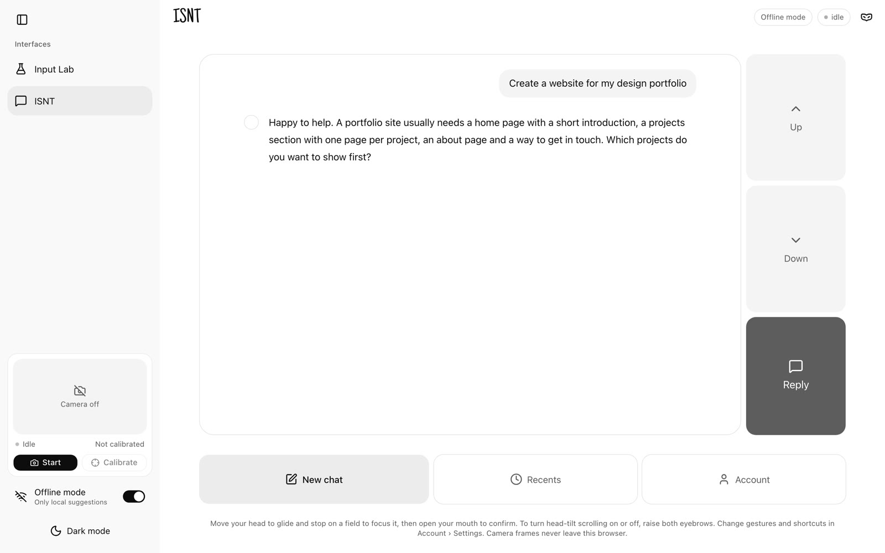</td>
  </tr>
  <tr>
    <td><b>Keyboard as a backup</b> for any word that isn't suggested.</td>
    <td><b>Read the answer</b> and scroll by tilting your head. Reply when you're ready.</td>
  </tr>
</table>

### 3. Shortcuts with your face

A few gestures work anywhere in the app. Each one can be changed in **Account › Settings**.

| Gesture | Default action |
| --- | --- |
| Open your mouth | Press the armed button |
| Tilt your head to your right shoulder | Send the message |
| Tilt your head to your left shoulder | Go back |
| Raise both eyebrows | Turn head scrolling on or off |
| Long blink | Go to Account |

## Made to fit you

Every person moves differently, so the app adapts to the person instead of the other way around.

<table>
  <tr>
    <td width="33%">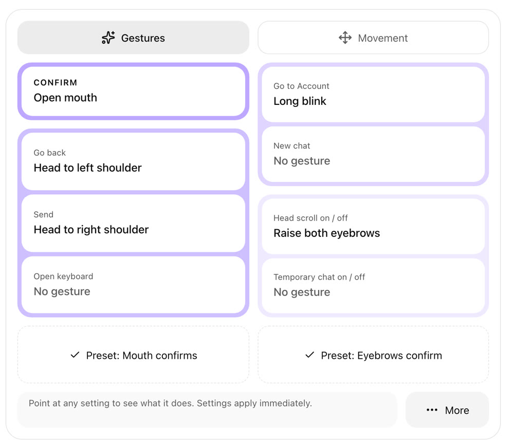</td>
    <td width="33%">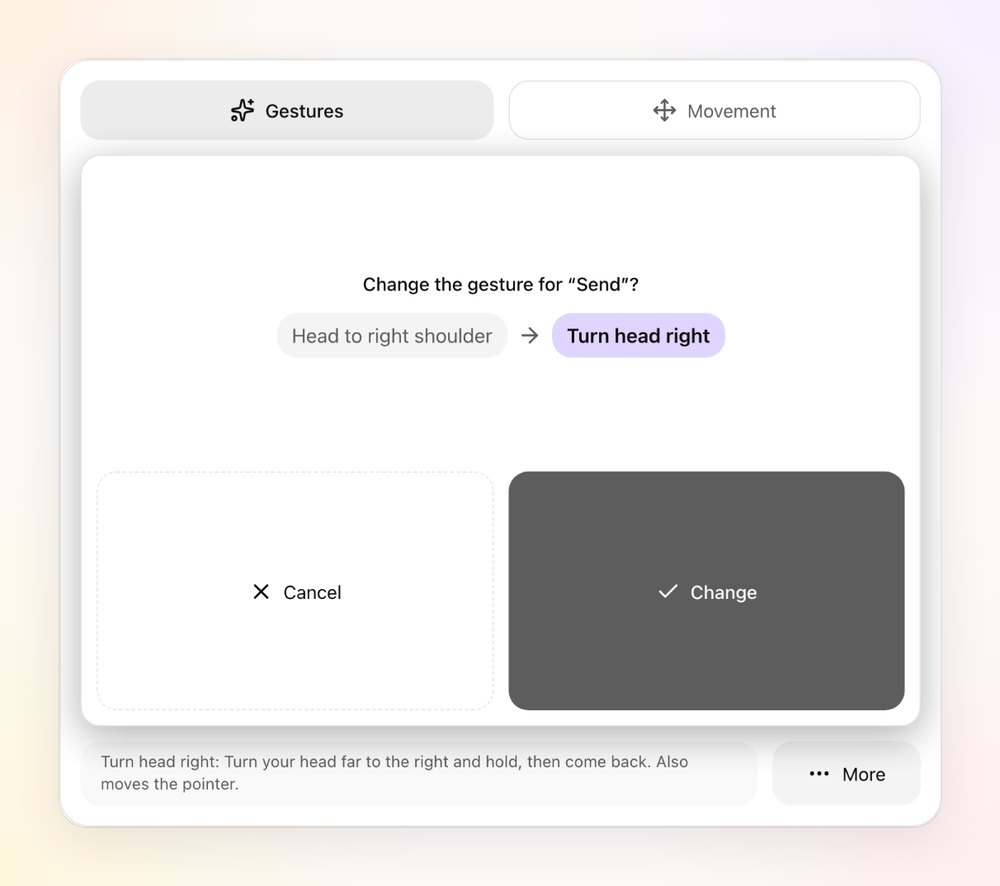</td>
    <td width="33%">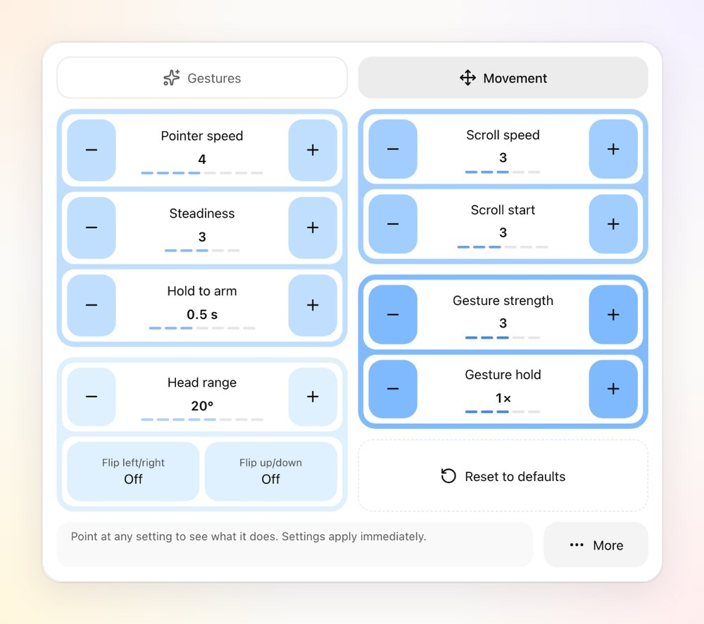</td>
  </tr>
  <tr>
    <td><b>Reassign any gesture</b> to any action.</td>
    <td><b>Changes always ask first</b>, so you can't switch something by accident.</td>
    <td><b>Tune the movement</b>: pointer speed, steadiness, how long to hold, how strong a gesture must be.</td>
  </tr>
</table>

Chats are saved in **Recents** and can be grouped into projects. ISNT opens in **light mode**, and **dark mode** is
one switch away.

<table>
  <tr>
    <td width="50%">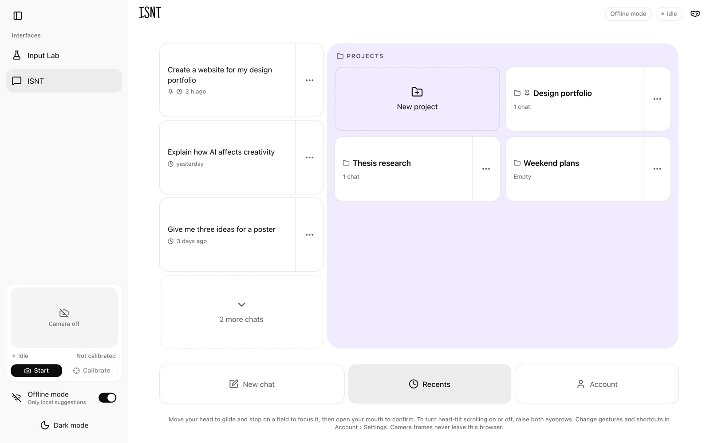</td>
    <td width="50%">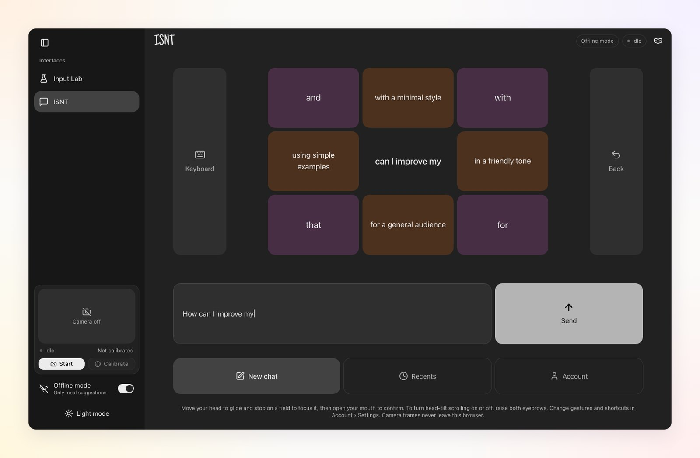</td>
  </tr>
</table>

## The look

<table>
  <tr>
    <td width="45%"></td>
    <td>
      <b>Every time ISNT opens</b>, the brand tube draws itself on in one stroke. Then ISNT bounces in letter by
      letter and spells out what it stands for: <b>I</b>ma <b>S</b>like <b>N</b>ema <b>T</b>ona, "picture, but no
      sound". It holds still long enough to read, then fades into the app.<br><br>
      <b>The tube</b> comes from original Illustrator artwork: a blend of soft circles in four pastels.<br><br>
      <b>The wordmark</b> is hand-drawn, set in Just Another Hand. Everything else stays quiet and neutral so the
      controls are easy to see.
    </td>
  </tr>
</table>

| | Butter | Peach | Rose | Lavender |
| --- | --- | --- | --- | --- |
| **Brand tube** | `#fdf7c3` | `#ffdeb4` | `#ffb4b4` | `#b2a4ff` |

Buttons in the app use a wider, softer pastel rainbow, so each position keeps its own colour.

## Privacy

The camera image **never leaves your browser**. Face tracking runs locally on your computer. Only the text of your
message is sent to the AI, and with **Offline mode** on, nothing is sent at all.

## Try it yourself

The quickest way is the live version: **[ima-slike-nema-tona.vercel.app](https://ima-slike-nema-tona.vercel.app)**.

To run it on your own computer, you need [Node.js](https://nodejs.org) and a webcam.

```bash
git clone https://github.com/nora-yapper/ChatGPT-no-Hands.git
cd ChatGPT-no-Hands
npm install     # also downloads the face-tracking model (about 4 MB)
npm run dev
```

Then open **http://localhost:3000**, press **Start** to turn on the camera and **Calibrate** while looking at the
screen for two seconds.

**AI suggestions and replies** come from [Claude](https://www.anthropic.com/claude). To use them, create a file
called `.env.local` in the project folder with your own key:

```
ANTHROPIC_API_KEY=your-key-here
```

Without a key, the app still works with simpler built-in suggestions and a placeholder reply. You can also click
any button with the mouse to try things out without the camera.

## Project status

ISNT is a **student design prototype** (Interactive IV, RIT Croatia, 2026). It has not yet been tested with people
who have motor or speech disabilities. That is the planned next step, and nothing here should be taken as proof
that it works for them.

The repository also contains **Input Lab** (at `/lab`), the testing ground used while building ISNT. It shows every
measurement between the camera and a button press, so gestures and thresholds can be compared.

## For developers

How the tracking pipeline, gesture detectors, layout grid and AI predictions work is described in
**[docs/TECHNICAL.md](docs/TECHNICAL.md)**. The launch screen lives in
`src/components/ChatNoHands/LaunchScreen.tsx`. Its tube path (`launchTube.ts`) is generated from the Illustrator
artwork, and it respects the system's reduce-motion setting.

```bash
npm test        # unit tests
npm run lint
```

## Research & open source

Sources and tools this project builds on. Keep this list current when a new one is used.

**Research / references**

- Villaroman, N., Rowe, D., & Helps, R. (2013). Design and evaluation of face tracking user interfaces for
  accessibility. In *Proceedings of the 2nd Annual Conference on Research in Information Technology* (pp. 65–70).
  ACM. https://doi.org/10.1145/2512209.2512218. Face tracking as cheap, non-intrusive input for people who can't use
  a mouse and keyboard. Its five stages of a face tracking interface (input, capture, feature retrieval, feature
  processing, pointer behaviour) structure the in-app **Technicalities** page (Account › Settings › More).
- University of Minnesota College of Continuing and Professional Studies. (n.d.). *Common writing prompt terms*.
  https://ccaps.umn.edu/esl-resources/students/writing/common-prompts. The common instruction verbs used in prompt
  writing; reviewed for the starter words.

The full reference list of the project documentation is in the presentation (section 08, References).

**Open-source tools**

- [MediaPipe Tasks Vision](https://github.com/google-ai-edge/mediapipe): face tracking in the browser
- [Next.js](https://nextjs.org), [React](https://react.dev), [TypeScript](https://www.typescriptlang.org)
- [Tailwind CSS](https://tailwindcss.com), [tw-animate-css](https://github.com/Wombosvideo/tw-animate-css)
- [shadcn/ui](https://ui.shadcn.com) on [Radix UI](https://www.radix-ui.com), with class-variance-authority, clsx and
  tailwind-merge
- [Lucide](https://lucide.dev) icons
- [Just Another Hand](https://fonts.google.com/specimen/Just+Another+Hand) (Google Fonts): the hand-drawn ISNT
  wordmark and greeting
- [Zod](https://zod.dev): checks the AI's responses
- [Anthropic TypeScript SDK](https://github.com/anthropics/anthropic-sdk-typescript): suggestions and replies
- [Vitest](https://vitest.dev), [ESLint](https://eslint.org): tests and linting

---

<p align="center"><sub>Designed and built by Nora Miskulin · RIT Croatia · 2026</sub></p>
